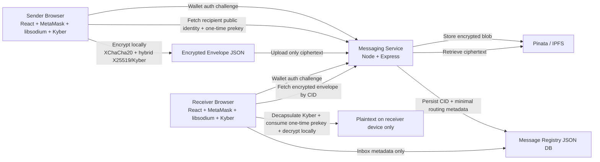

# Secure Messaging Module

This module adds hybrid end-to-end encrypted messaging to Lulit without storing plaintext on centralized infrastructure.

## Architecture Diagram

## Security Design

- Plaintext is encrypted in the sender browser before upload.
- The messaging service only sees ciphertext, recipient routing info, and the resulting CID.
- Wallet addresses act as decentralized user identifiers.
- MetaMask `personal_sign` is used for authentication and sender-controlled authorization.
- Libsodium provides local authenticated encryption and X25519-based classical E2EE.
- One-time X25519 prekeys are consumed after decryption to reduce long-term compromise impact.
- Kyber is used as an additional key-wrapping layer for post-quantum confidentiality readiness.
- Dilithium is included for optional PQ signatures over the encrypted envelope digest.
- IPFS stores only the encrypted envelope; the registry stores only the CID and routing metadata.
- Optional Tor support can be enabled for backend IPFS reads by setting `TOR_SOCKS_URL`.

## Security Modes

### Standard Secure

- Hybrid E2EE with libsodium + Kyber
- Normal inbox metadata
- Best for everyday conversations

### Private Mode

- Forces a fresh wallet-auth step before send
- Hides sender preview in inbox until decrypt
- Avoids showing inbox timestamps
- Auto-clears decrypted plaintext after a short window in the UI
- Better for sensitive messages or media

## Important Limitation

This design is a strong hybrid readiness model, not a formally audited Signal replacement.

- Browser-side PQC uses WebAssembly bindings, which increases bundle size.
- True post-quantum forward secrecy for asynchronous messaging is hard; this design improves resilience with one-time classical prekeys plus Kyber wrapping, but it should still be treated as an advanced prototype until formally reviewed.
- Metadata minimization is improved, but sender and recipient wallet routing still exists in the message registry.

## Key Flows

### Sender

1. Authenticate to the messaging service with a MetaMask signature challenge.
2. Fetch the recipient identity and reserve a one-time prekey.
3. Generate a fresh message key and sender ephemeral key.
4. Encrypt plaintext with XChaCha20-Poly1305.
5. Wrap the message key using a hybrid of:
   - sender ephemeral X25519 to recipient one-time X25519 prekey
   - Kyber encapsulation to recipient one-time Kyber prekey
6. Upload the encrypted envelope to IPFS through Pinata.
7. Store only the CID and minimal metadata in the registry.

### Receiver

1. Authenticate with a MetaMask signature challenge.
2. Load inbox metadata.
3. Fetch the encrypted envelope from IPFS by CID.
4. Decapsulate the Kyber ciphertext with the reserved private prekey.
5. Use the matching one-time X25519 private prekey plus sender ephemeral public key to derive the hybrid wrapping key.
6. Decrypt locally and immediately consume the one-time prekey.

## Environment Variables

### Frontend

- `VITE_MESSAGING_API_BASE_URL`

### Messaging Service

- `PORT`
- `MESSAGING_JWT_SECRET`
- `MESSAGING_CORS_ORIGIN`
- `PINATA_JWT`
- `PINATA_GATEWAY_URL`
- `MESSAGE_STORE_FILE`
- `TOR_SOCKS_URL`

## Sources

- Libsodium authenticated public-key cryptography docs: https://doc.libsodium.org/public-key_cryptography/authenticated_encryption
- Libsodium AEAD docs: https://doc.libsodium.org/secret-key_cryptography/aead
- MetaMask signature auth docs: https://docs.metamask.io/wallet/how-to/sign-data/
- Pinata upload docs: https://docs.pinata.cloud/files/uploading-files
- Pinata Node.js docs: https://docs.pinata.cloud/frameworks/node-js
- Dashlane PQC JS bindings for Kyber and Dilithium: https://github.com/Dashlane/pqc.js/
